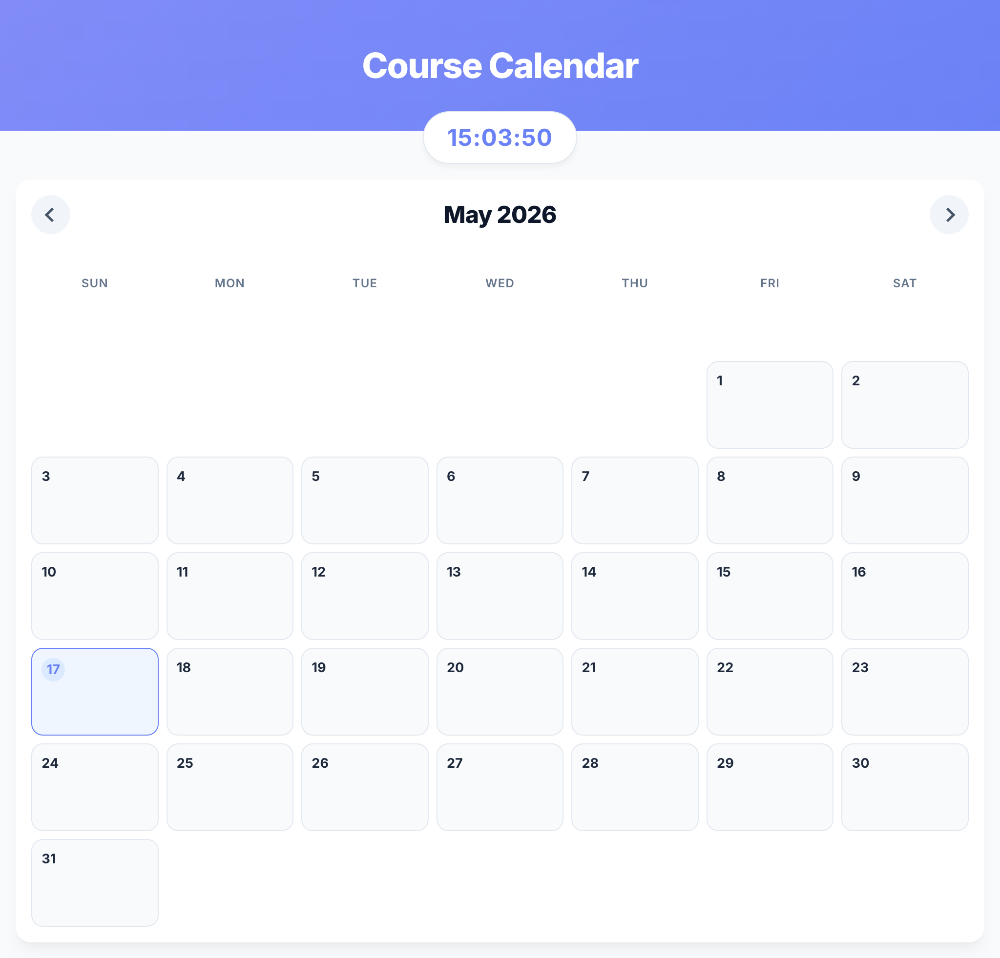

# Course Calendar App

A simple PHP and MySQL course calendar application that lets students track classes, instructors, and event times on a responsive monthly calendar.

## Features

- Display a monthly calendar with current day highlighting
- Add course events with course name, instructor, date range, and time range
- Filter visible course events using a color legend
- Edit or delete existing course events
- Persist events in a MySQL database
- Responsive, modern UI with day hover controls and a live clock

## Project Files

- `index.php` — main application page and layout
- `calendar.php` — backend event handling and database queries
- `calendar.js` — calendar rendering, month navigation, and modal event UI
- `connection.php` — database connection settings
- `style.css` — styling for the calendar, modal, buttons, and layout

## Requirements

- PHP (compatible with XAMPP)
- MySQL / MariaDB
- Web browser
- XAMPP or another local development server

## Setup

1. Place the project folder in your web server root directory (for example, `htdocs` in XAMPP).
2. Start Apache and MySQL in XAMPP.
3. Create a MySQL database named `course_calendar`.
4. Create the `appointments` table with the following schema:

```sql
CREATE TABLE appointments (
  id INT AUTO_INCREMENT PRIMARY KEY,
  course_name VARCHAR(255) NOT NULL,
  instructor_name VARCHAR(255) NOT NULL,
  start_date DATE NOT NULL,
  end_date DATE NOT NULL,
  start_time TIME NOT NULL,
  end_time TIME NOT NULL,
  selected_days VARCHAR(255) NOT NULL,
  course_color VARCHAR(7) NOT NULL DEFAULT '#6B82F6'
);
```

5. Update `connection.php` if your MySQL credentials or database name differ from the defaults:

```php
$username = "root";
$password = "";
$database = "course_calendar";
```

6. Open `index.php` in your browser through the local server, for example:

```text
http://localhost/calendar-app/course-calendar/index.php
```

## Usage

1. Use the arrow buttons at the top of the calendar to change the displayed month.
2. Click `+ Add` on a day cell to open the add-event modal.
3. Fill in `Course Name`, `Instructor Name`, `Start Date`, `End Date`, `Start Time`, and `End Time`.
4. Click `Save Event` to store the event in the calendar.
5. To edit an event, use the `Edit Events` button on days with events.
6. To delete an event, use the `Delete Event` button in the edit modal.

## Notes

- Multi-day events are expanded so each day in the selected range displays the event.
- The calendar data is stored in the `appointments` table.
- Event creation, editing, and deletion are handled through POST requests in `calendar.php`.

## Troubleshooting

- If the calendar does not load, verify your PHP server is running.
- If events are not saved, confirm the database connection settings in `connection.php` and the table schema.
- Use browser developer tools to inspect console errors from `calendar.js`.

---

## Screenshots




